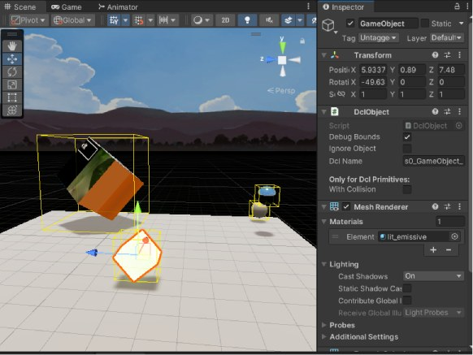
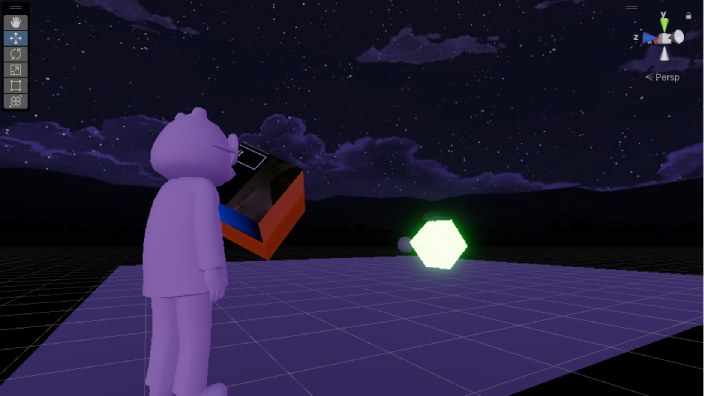
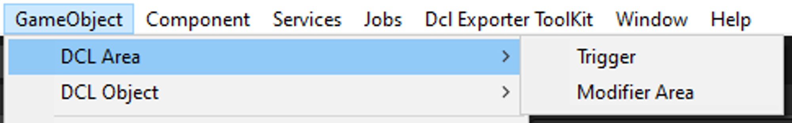
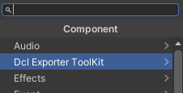

# README/

Status: Iterating
Team: Artworks
Milestone: Core Items
Assign: Hugo Serichol
Last Edited: Hugo Serichol
Created time: January 8, 2024 8:29 AM

**Premise**

<aside>
🎓 This guide will take you through the **Decentraland Exporter Toolkit**, in order to learn how each part of the toolkit works and have a clear vision about what can we do from the Unity editor.

</aside>

**The mission**

<aside>
🎓 Create an user guide to **explain** the usage of the **Decentraland Exporter Toolkit** for every new user that wants to create scenes in Dcl from Unity.

</aside>

<aside>
⚙️ **Resources**

- Unity 2022.3.12f1 - [https://unity3d.com/es/get-unity/download/archive](https://unity.com/releases/editor/archive)
- Unity Hub [https://unity.com/download](https://unity.com/download)
</aside>

<aside>
📋 Decentraland Exporter Toolkit

</aside>

---

## 🏗️ Getting Started

### Installing the Unity Editor

<aside>
💻 **Unity Editor**

First of all we need to install the Unity Editor. We highly recommend installing the [Unity Hub](https://unity.com/download) as well to simplify the process. After installing **Unity Hub,** let’s head to the [Unity Archive](https://unity3d.com/es/get-unity/download/archive) and look for the **Unity 2022.3.12** version click on “Unity Hub” button to install the Editor.

Unity version download button

</aside>

### Unity URP

<aside>
☀️ **Universal Render Pipeline**

Now it’s time to install URP in a new Unity project. This will be necessary for our Exporter Toolkit to work properly.

In Unity Hub, click on **New Project,** this will open a window with different templates, select the **3D Core** option and click on **Create Project.**

New Project templates

To install URP via package manager go to *Window → Package Manager*

Package Manager route

Change the Packages in top left to *Unity Registry* and look for the **Universal RP** package to install it.

URP Package installation

</aside>

### Exporter Toolkit **Installation**

<aside>
📦 **Unity Package**

You will need to download and **install the Unity Package** with the Exporter Toolkit. You can find the latest version in [this Github repository](https://github.com/PolygonalMind/dcl-dev-exportersdk7-release). Double click the package to import it to your Unity project.

Importing Unity Package

</aside>

<aside>
☀️ **URP Configuration**

Go to the Project Settings, you can find it in *Edit → Project Settings* top left of your screen. Now, in the *Graphics* tab, set-up the **URP Asset** that comes in the Exporter ToolKit package. Open the *Scriptable Render Pipeline Settings* tab by clicking on the circle icon on the right and select the URP Asset.

Dcl Exporter ToolKit URP Configuration

</aside>

<aside>
🛠️ **Dcl Exporter ToolKit**

Now that everything is set-up, let’s open the Exporter. You can find it in the *Dcl Exporter ToolKit* tab, top of your screen. Open the *Control Panel* option to get started.

Control Panel tab

</aside>

### **Dependencies**

<aside>
🔗 **Dependencies**

The first time opening the exporter, this window will show all the dependencies needed to use the exporter.

Dependencies editor window

In this editor window, you can manage the dependencies with a simple 4-step guide to initialize your project. You can't proceed further in the tool without installing the dependencies and clicking the "**Check Dependencies**" button. This will execute a cmd command to check if Node.js and the npm packages are installed on your computer.

</aside>

### **DCL project creation**

<aside>
📁 **Dcl Project Creation**

Below the Dependencies you can find a **Create New Project** button, this will set-up our Dcl project route and files. Click it and select an empty folder inside your Unity project.

Creating Dcl Project

Now go to the *Exporter* tab of the Control Panel, in this interface you will be able to Export and Run your Dcl projects. For now, to make sure everything is working properly, click on the *Run Local* option down below. This will open a tab in your browser to run a local test of your Dcl Project.

Exporter Tab

If everything is correct, you will spawn in an empty Dcl scene that looks like this:

Local Test

</aside>

### Exporter ToolKit Interface

Now that we have succesfully created our first Dcl project from scratch, let’s go back to the Exporter’s interface and have a more in depth look into each tab so we can start developing our Dcl scene.

Exporter Tabs

<aside>
🖥️ **Config**

<aside>
🔗 **Dependencies**

Back in the Config tab, below the Dependencies’ installers we previously used, we can find the Dependencies Version Control.

This is a small box that displays all the installed dependencies versions and contains 2 buttons to check if there are new dependencies versions installed or clear the dependencies information if you want to go back to the previous window to manage dependencies.

Dependencies UI

</aside>

<aside>
📁 **Project Setup**

Here we can create a new Dcl project from scratch in an empty folder (as we have previously done), locate an already existing project manually, or use the Autofind feature, which will show all available projects to choose one from.

Project Setup UI

</aside>

</aside>

<aside>
🖥️ **Manager**

<aside>
📄 **Scene Metadata**

Decentraland Metadata UI

Here you can set up all the Dcl metadata needed including Land Name, Description, Spawn Points, etc.

The *Open Parcel Editor* button at the top open a new window where you can configure the parcels for your Dcl Scene.

Parcel Manager

In this window, you can:

- Create regular parcels with a fixed size.
- Create a custom parcel drawing in a grid starting from the base parcel at the bottom left corner.
- Edit the parcel list manually.
    
    This parcel creation form must maintain the following structure:
    
    "[X],[Y]
    
    [X],[Y]
    
    [X],[Y]"
    
    The first parcel will be the base, located at the bottom left corner of the scene.
    
- Obtain the Dcl parcels from the marketplace, using the link or just the token ID of a decentraland estate.
</aside>

<aside>
🛡️ **Special Permissions**

Depending on your gameplay configurations you may need to enable certain special permissions:

- **Enable voice chat:** allows users to use voice chat in the scene
- **Enable Portable Experiences:** enables the use of smart wearables

</aside>

</aside>

<aside>
🏗️ **Builder**

<aside>
📊 **Statistics**

In the next part we have one of the main features of the exporter, it shows info about the current scene like the number of triangles, objects, entities, materials, etc. It shows the recomended limit of each resource based on your parcel size to have an optimized scene and avoid exceeding the limits of Decentraland.

To update this info we need to Refresh the scene by clicking the button or selecting a time interval to auto refresh the scene. Refreshing the scene for the first time will create a GameObject called .dclManager that will be ignored during the Export, It contains info and the scene metadata to be exported.

Stats UI

In this part we can also set the bounding boxes from every mesh with a dcl object and debug bounding box active. This will be useful to make sure every bounding box is within our parcel’s boundaries.

Bounding Boxes

</aside>

<aside>
☀️ **Decentraland Skybox & Illumination**

Decentraland Skybox & Illumination UI

In this section we can manage the Dcl Skybox to preview the illumination and reflection probe at different daytimes, This is a helpfull tool to save time checking the illumination in unity before exporting to Decentraland.

00h Skybox Illumination

04h Skybox Illumination

08h Skybox Illumination

12h Skybox Illumination

16h Skybox Illumination

20h Skybox Illumination

</aside>

</aside>

<aside>
🪄 **Exporter**

<aside>
🔗 **CLI**

Decentraland CLI UI

In this section we can Initialice a new Dcl project, Update the Decentraland CLI in our computer or Update the SDK in the selected project.

</aside>

<aside>
📝 **Export Options**

In this section of the exporter window, we will find the main feature of the ToolKit, which is the Export option. This option translates our Unity scene into code written in the index.ts file, which is the script used to build Dcl scenes. Every time we export, the index.ts file is deleted and rewritten, so keep this in mind if you are manually editing parts of the index.ts.

There is secondary export options, which execute “partial” exports depending on the current needs of your scene, we will see use cases later on.

Export UI

Before you export you can also select the type of GLB you want to export.

GLB export type

</aside>

<aside>
📁 **Decentraland Project**

Decentraland Project folder UI

In this section, we can manage the Dcl project folder. We can **open** the **root folder**, open specific scripts like **scene.json** with the metadata, **index.ts** where the main code is exported, or the **package.json** script.

We can also run a Dcl scene locally to test our exports by executing a cmd command from Unity.

</aside>

</aside>

---

## 🌐 Primitives & Areas

### Dcl Primitives

<aside>
🧊 **Box**, **Plane**, **Sphere** and **Cylinder**

You can spawn primitive objects that won’t be exported as GLTF meshes but as Decentraland primitives. You can spawn this objects by right click in the Hyerarchy or directly accessing the GameObject tab in the Unity toolbar.

Dcl Primitives menu

</aside>

### Dcl Areas

<aside>
↔️ **Trigger Area** and **Modifier Areas**

You can create custom Areas that will create Triggers or Modifier Areas in Decentraland, You can use this areas as inputs for Animation, Teleports, etc.

Spawn this areas just like the primitives before, in the GameObject Unity menu.

Dcl Area menu

This is how the default Trigger Area looks like:

Default Trigger Area

- **Trigger**: Trigger areas have 2 configurable lists of events for enter and exit events

Trigger area component UI

- **Modifier**: This areas are specific from Decentraland and let you control the player camera and hide avatars or passports from players inside the area.

Modifier area component UI

</aside>

## 🎨 Materials

You can create custom materials for your objects. To make a new material go to *Assets → Create → Material*.

Create a Material

<aside>
🪄 **Material properties**

There are multiple properties we can customize for the material, the basic ones are:

- **Base Map:** changes the color of the object
- **Metallic Map:** this will change how “metallic” your object looks, by increasing or decreasing the amount of influence the skybox has over the tint of the object’s reflections.
- **Smoothness:** amount of reflectiveness the object has. More smoothness, more reflectiveness.
- **Normal Map:** controls how the object’s surface reacts to lighting.
- **Emission:** adds a “glowing” effect to the object

Here’s some examples of different materials with different properties:

*Example 1: 0.5 Metallic / 0.5 Smoothness*

Material example 1

*Example 2: 1 Metallic / 1 Smoothness*

Material example 2

*Example 3: 0 Metallic / 0 Smoothness*

Material example 3

*Example 4: 0.5 Metallic / 0.5 Smoothness / Yellow Emissive*

Material example 4

*You can use a custom texture image for each of the properties when working with non-primitive assets.* Later w*e will see a practical example of this in a video tutorial.*

</aside>

## ⚙ Components

You can find all the aviable components when clicking ***Add Component*** in any gameObject and search for the submenu ***Dcl Exporter ToolKit.***

Dcl Exporter ToolKit components Sub-Menu

### DclObject

<aside>
⚙ **DclObject.cs**

This component is the base of the exporter, clasify every entity in diferent types like Dcl Primitives, GLTF, Text Shapes, NFTs and more.
This different DclObjects will have a different behaviour when exporting the solution.

The component is needed if you want that gameObject to appear in the game.ts script.

DclObject component UI

DclObject can modify collisions from here for Dcl primitives and will show the gameObject  name for the Decentraland export.

The checkbox Debug Bounds will draw the bounding box of a mesh when selected or activated in the statistics section.
By clicking in ignore object, This DclObject won’t be exported and this object will be ignored during the export.

</aside>

### **Animator Dcl**

<aside>
⚙ **AnimatorDcl.cs**

The AnimatorDcl is an alternative to the Unity Animator with the clips that will be exported into a Decentraland Animator.

Custom animator component UI

The default Animation will be the animation playing if we set the Start Playing checkbox to true.

Each clip have a few parameters to control if the clip should loop and the animation speed.

</aside>

### Audio Source Dcl

<aside>
🎶 **AudioSourceDcl.cs**

With this component you willl create a Decentraland AudioSource on this entity, You can set a default clip with params and a list of clips to activate through input events or however you want.

Audio source component UI

</aside>

### Streaming

<aside>
📽️ **Stream Video**

This component gives you the ability to export a streaming video screen, should be attached to a primitive plane as screen but you can use other Decentraland primitives.

Set the video URL that can also be a relative path to a video in the decentraland project folder and this video will be playing in the screen.

Stream video component UI

</aside>

<aside>
🖼️ **Stream Image**

This is similar to the Stream Video component but getting an image from the URL instead of a video.

Stream image component UI

</aside>

### GLTF

<aside>
🎓 **Force GLTF** - **Force_GLTF.cs**

This component will ignore the dcl object type and will force to export the object as GLTF.

Can be used for example to combine multiple meshes in a single one with an empty parent and this component.

</aside>

<aside>
🎓 **Break Child** - **Break_Child.cs**

This component will export the object as a single GLTF. It's used for child objects that you want to export as individuals.

</aside>

<aside>
🎓 **GLB Placeholder** - **glbPlaceholder.cs**

With this component, you can set a path and the exporter will create a GLTF shape with the model in the selected path. It works very similarly to the Stream Image/Video components. Keep in mind, your GLTF shape will inherit the placeholder’s transformations.

</aside>

<aside>
🎓 **Late Loader** - **lateLoadMesh_script.cs**

This will force the mesh to be written in the last part of the index.ts

</aside>

<aside>
🎓 **Prefab Overwritter** - **ovewriteMesh_script.cs**

Prefabs are exported as a single mesh to instanciate over the scene multiple times, if you want any specific prefab to export as a normal GLTF you can add this component.

</aside>

### Billboard

<aside>
🪟 **BillboardDcl.cs**

Adding this component to any gameObject will make it face the player camera in Dcl, you have options to fix the rotation around an axis to do different types of billboards.

Billboard component UI

</aside>

### InputEventDcl

<aside>
🖱️ **InputEventDcl.cs**

With this component you will be able to create pointer input events to play animations, teleports, open links, etc.

Input event component UI

You can create a list of events that will be executed in an event when pressing the button selected while aiming to a gameobject.

You can switch between pointer down and pointer up, set the hover text and the distance to interact. and Select the input button in a list with multiple options.

</aside>

---