# Unity Exporter for Decentraland Documentation

**Premise**

🎓 Create an user guide to **explain** the usage of the **Decentraland Exporter Toolkit** for every new user that wants to create scenes in Dcl from Unity.

**The mission**

🎓 This guide will take you through the **Decentraland Exporter Toolkit**, in order to learn how each part of the toolkit works and have a clear vision about what can we do from the Unity editor.

⚙️ **Resources**

- Unity 3D - [https://unity3d.com/es/get-unity/download/archive](https://unity3d.com/es/get-unity/download/archive)

📋 Decentraland Exporter ToolKit

---

## 🏗️ Getting Started

### Unity URP

☀️ **Universal Render Pipeline**

First of all we need to install URP in a new Unity project (**2023.3.12f1** recomendeed).

 We can do this via package manager (This will be a dependencie in our Unity package in the future)

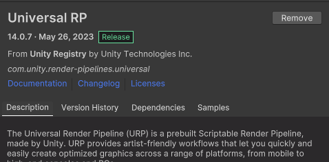

URP in package manager

Once URP is installed, go to the ToolKit package Installation

### Package **Installation**

📦 **Unity Package**

We will need to download and **install the unity package** with the Exporter toolkit (Recommended Unity Editor Version **2022.3.12f1**)

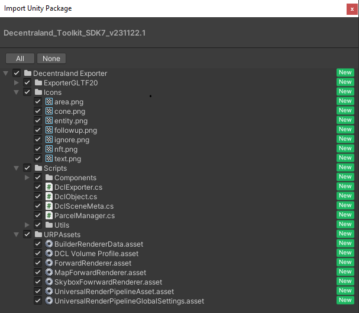

ToolKit Package Content

☀️ **URP Config**

Go to the player setting and set up the URP Asset that comes in the Exporter ToolKit package.

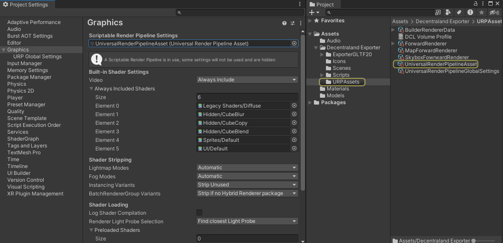

Dcl Exporter ToolKit URP Configuration

This menu contains 3 editor windows with different function, We will only use the first one to create the Decentraland exports but we also have the possibility to export Gltfs from the scene or manage the Decentraland scene parcels config. 

🛠️ **Dcl Exporter ToolKit**

Once the package is installed, a new menu should appear in the Unity Editor toolbar.

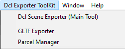

Dcl Exporter ToolKit toolbar

This menu contains 3 editor windows with different function, We will only use the first one to create the Decentraland exports but we also have the possibility to export Gltfs from the scene or manage the Decentraland scene parcels config. 

### **Dependencies**

🔗 **Dependencies**

This is the main Editor Window used to export Decentraland Scenes.

The first time opening this Window will show all the dependencies needed to use the exporter.

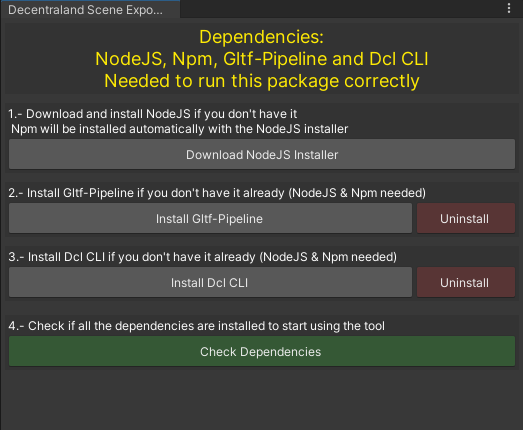

Dependencies editor window

In this editor window you can manage the dependencies in your computer with a simple 4 steps guide to Initialize your project. You cant go further in the tool without installing the dependencies and click the “**Check Dependencies**” button.
This will execute a cmd command to check if NodeJs and the npm packages are installed in your computer.

Once the dependencies are installed, this window will change after Checking the dependencies and will show a new interfaz.

### **Dcl project creation**

📁 **Dcl Project Creation**

Now you need to select a valid Decentraland project folder or an empty folder to create the base Dcl project

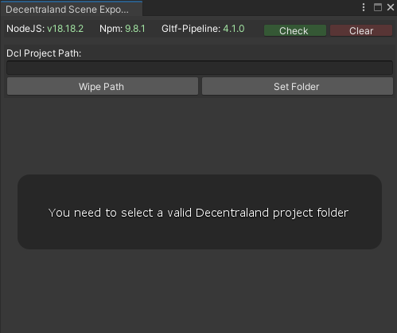

If you select an empty folder, a few options will appear to initialice a new Dcl project

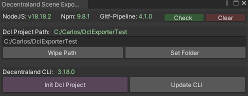

Editor window for empty folder selected

Click on “**Init Dcl Project**” to create the base Dcl project in the selected folder. This will run a cmd command, the cmd promp may ask you to install the last sdk before continue with the installation, just write Y for yes if you agree to continue.

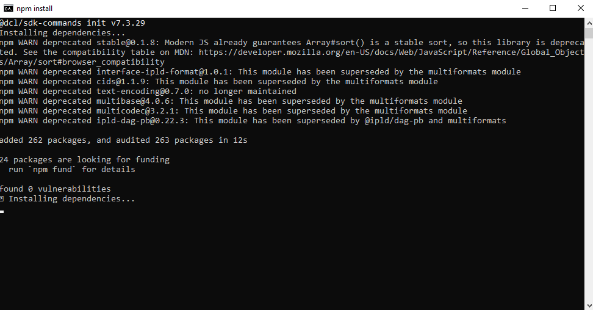

Dcl project creation prompt

Wait untill the Dcl project is created to move on to the next step.
Once the project is initialiced the editor window should look like this

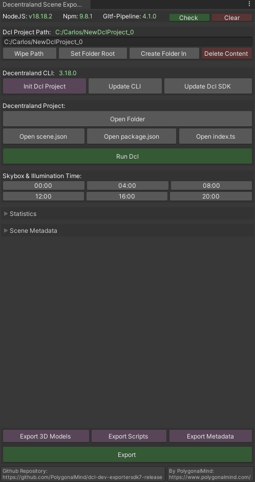

Exporter UI Ready to export Dcl scenes

Now you are ready to export Unity Scenes to Decentraland.

### Exporter Editor Window

Once the Dcl project is ready and we can see the full exporter windows with all the dependencies installed we can export any unity scene to Dcl, to do this we need to know the exporter capabilities so it’s time to explain this editor window part by part.

🔗 **Dependencies**

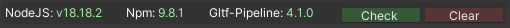

Dependencies UI

This is a little box that shows all the dependencie versions installed and contains 2 buttons to check if there are new dependencie versions installed or clear the dependencies info if you want to see the previous window to manage dependencies.

📁 **Project path**

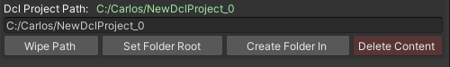

Project path UI

In this part we can manage the Dcl path and we also have the ability to delete all the contents inside the selected folder in case that we want to initialice a new base Dcl project in the same location.

🔗 **CLI**

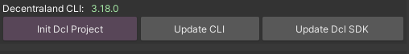

Decentraland CLI UI

In this section we can Initialice a new Dcl project, Update the Decentraland CLI in our computer or Update the SDK in the selected project.

📁 **Decentraland Project**

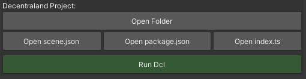

Decentraland Project folder UI

In this section we can manage the Dcl project folder, we can **open** the **root folder**, open specific scripts like **scene.json** with the metadata, **index.ts** where the main code is exported or the **package.json** script.

We can also run a dcl scene locally to test our exports executing a cmd command fom Unity.

☀️ **Decentraland Skybox & Illumination**

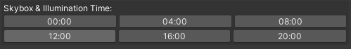

Decentraland Skybox & Illumination UI

In this section we can manage the Dcl Skybox to preview the illumination and reflection probe at different daytimes, This is a helpfull tool to save time checking the illumination in unity before exporting to Decentraland.

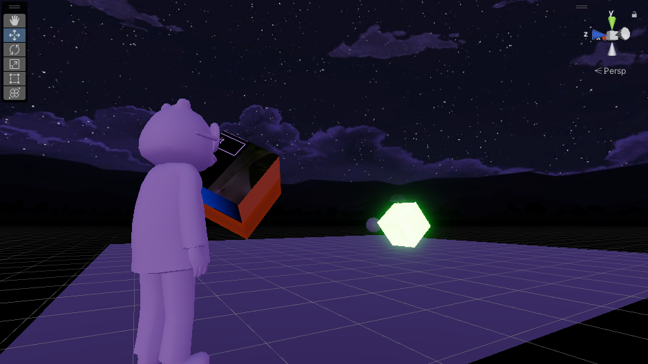

00h Skybox Illumination

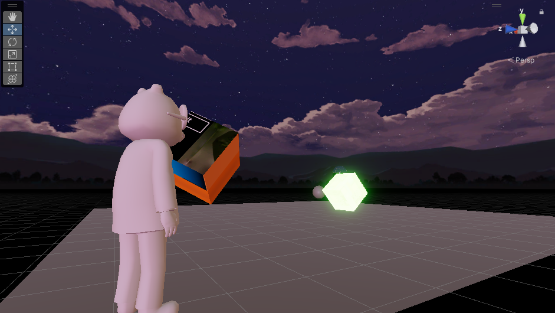

04h Skybox Illumination

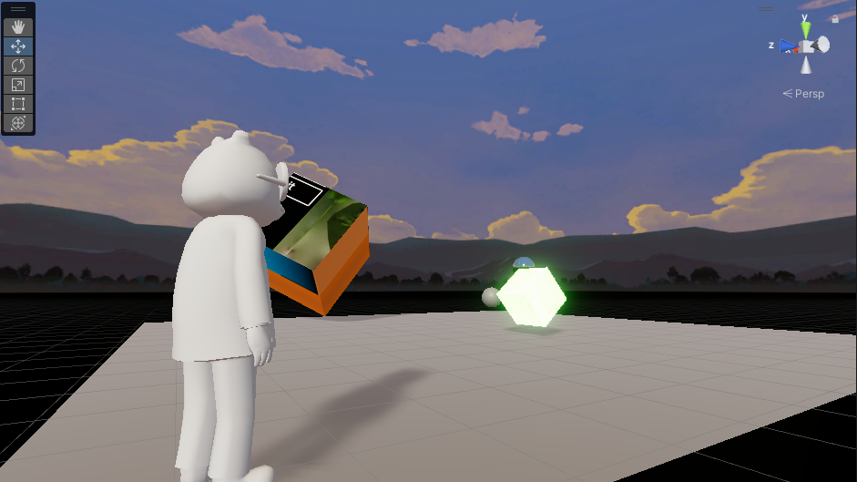

08h Skybox Illumination

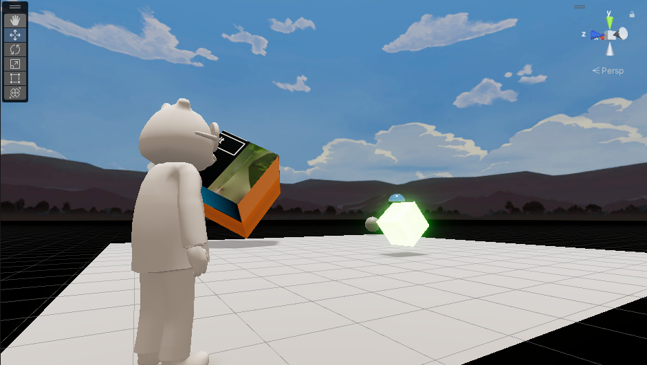

12h Skybox Illumination

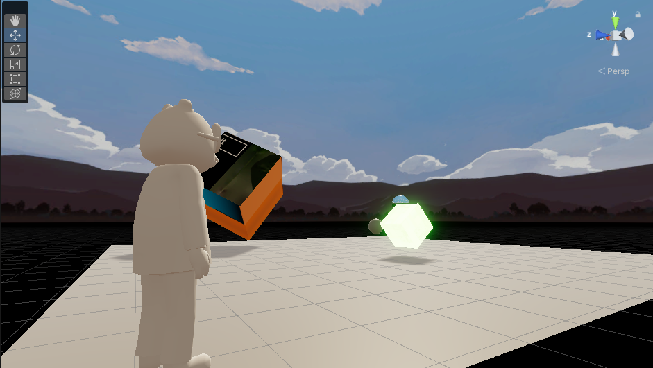

16h Skybox Illumination

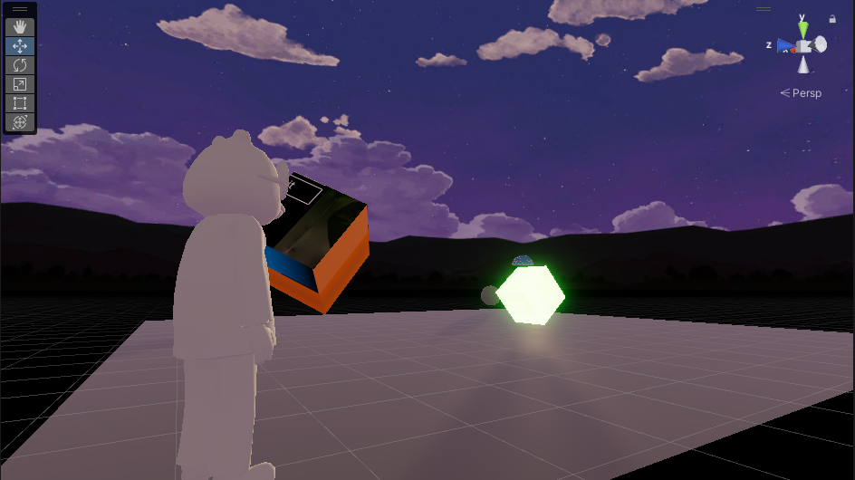

20h Skbox Illumination

📊 **Statistics**

In the next part we have one of the main features of the exporter, it shows info about the current scene like the number of triangles, objects, entities, materials, etc.

To update this info we need to Refresh the scene by clicking the button or selecting a time interval to auto refresh the scene. Refreshing the scene for the first time will create a GameObject called .dclManager that will be ignored during the Export, It contains info and the scene metadata to be exported.

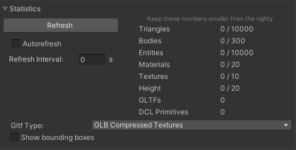

Decentraland Statistics UI

In the bottom of this part we can select the type of gltf export that we want in our project:

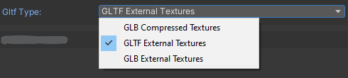

glTF export type

In this part we can also set the bounding boxes from every mesh with a dcl object and debug bounding box active.

📄 **Scene Metadata**

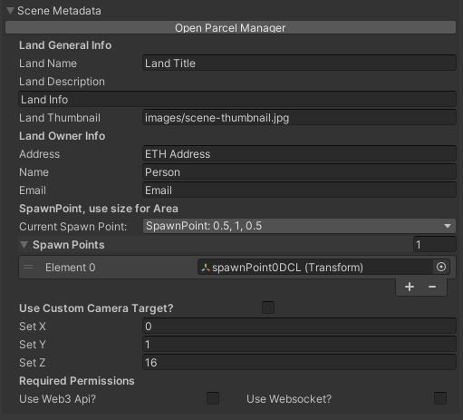

Decentraland Metadata UI

Here you can set up all the Dcl metadata needed including spawnpoints, info, description, permissions and more.

The little button at the top open a new window where you can configure the parcels for your Dcl Scene.

In this window you can:

- Create regular parcels with a fixed size.
- Create a custom parcel drawing in a grid starting from the base parcel al the bottom left corner.
- Edit the parcel list manually.
    
    This parcel creation form must keep the next structure:
    
    “[X],[Y]
    
    [X],[Y]
    
    [X],[Y]”
    
    Being the first parcel the base that will be in the bottom left corner of the scene.
    
- Get the Dcl parcels from the marketplace, using the link or just the token id of a decentraland estate.

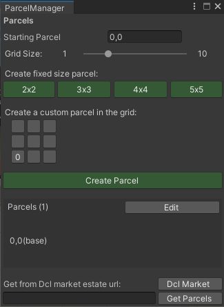

📝 **Export Options**

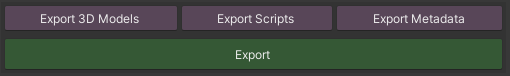

Export options UI

In the last section of the exporter window we will see this buttons to do a full export or do little exports part by part.
This can avoid time while exporting big scenes if we only did a few changes that affect a part of the decentraland project like changing metadata info.

---

## 🌐 Primitives & Areas

### Dcl Primitives

🧊 **Box**, **Plane**, **Sphere** and **Cylinder**

You can spawn primitive objects that won’t be exported as glTF meshes but as Decentraland primitives. You can spawn this objects by right click in the Hyerarchy or directly accessing the GameObject tab in the Unity toolbar.

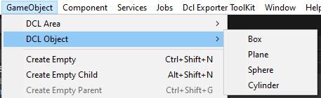

Dcl primitive menu

### Dcl Areas

↔️ **Trigger Area** and **Modifier Areas**

You can create custom Areas that will create Triggers or Modifier Areas in Decentraland, You can use this areas as inputs for Animation, Teleports, etc.

Spawn this areas just like the primitives before, in the GameObjec t Unity menu.

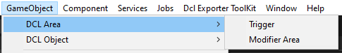

Dcl Area menu

- **Trigger**: Trigger areas have 2 configurable lists of events for enter and exit events

Trigger area component UI

- **Modifier**: This areas are specific from Decentraland and let you control the player camera and hide avatars or passports from players inside the area.

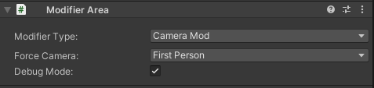

Modifier area component UI

## ⚙ Components

You can find all the aviable components when clicking ***Add Component*** in any gameObject and search for the submenu ***Dcl Exporter ToolKit.***

Dcl Exporter ToolKit components Sub-Menu

### DclObject

⚙ **DclObject.cs**

This component is the base of the exporter, clasify every entity in diferent types like Dcl Primitives, GLTF, Text Shapes, NFTs and more.
This different DclObjects will have a different behaviour when exporting the solution.

The component is needed if you want that gameObject to appear in the game.ts script.

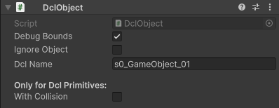

DclObject component UI

DclObject can modify collisions from here for Dcl primitives and will show the gameObject  name for the Decentraland export.

The checkbox Debug Bounds will draw the bounding box of a mesh when selected or activated in the statistics section.
By clicking in ignore object, This DclObject won’t be exported and this object will be ignored during the export.

### **Animator Dcl**

⚙ **AnimatorDcl.cs**

The AnimatorDcl is an alternative to the Unity Animator with the clips that will be exported into a Decentraland Animator.

Custom animator component UI

The default Animation will be the animation playing if we set the Start Playing checkbox to true.

Each clip have a few parameters to control if the clip should loop and the animation speed.

### Audio Source Dcl

🎶 **AudioSourceDcl.cs**

With this component you willl create a Decentraland AudioSource on this entity, You can set a default clip with params anda list of clips to activate through input events or however you want.

Audio source component UI

### Streaming

📽️ **Stream Video**

This component give you the ability to export a streaming video screen, should be atached to a primitive plane as screen but you can use other Decentraland primitives.

Set the vide URL that can also be a relative path to a video in the decentraland project folder and this video will be playing in the screen.

Stream video component UI

🖼️ **Stream Image**

This is similar to the previous component but getting an image from the URL instead of a video.

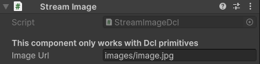

Stream image component UI

### GLTF

🎓 **Force GLTF** - **Force_GLTF.cs**

This component will ignore the dcl object type and will force to export the object as gltf.

Can be used for example to combine multiple meshes in a single one with an empty parent and this component.

🎓 **Break Child** - **Break_Child.cs**

This component will export the object as a single gltf, its used for child objects that you want to export as individuals.

🎓 **GLB Placeholder** - **glbPlaceholder.cs**

With this component you can set a path and the exporter will create a gltf shape with the model in the selected path.

🎓 **Late Loader** - **lateLoadMesh_script.cs**

This will force the mesh to be written in the last part of the index.ts

🎓 **Prefab Overwritter** - **ovewriteMesh_script.cs**

Prefabs are exported as a single mesh to instanciate over the scene multiple times, if you want any specific prefab to export as a normal gltf you can add this component.

### Billboard

🪟 **BillboardDcl.cs**

Adding this component to any gameObject will make it face the player camera in Dcl, you have options to fix the rotation around an axis to do different types of billboards.

Billboard component UI

### InputEventDcl

🖱️ **InputEventDcl.cs**

With this component you will be able to create pointer input events to play animations, teleports, open links, etc.

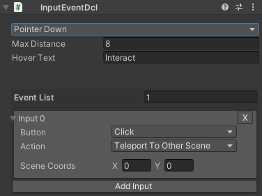

Input event component UI

You can create a list of events that will be executed in an event when pressing the button selected while aiming to a gameobject.

You can switch between pointer down and pointer up, set the hover text and the distance to interact. and Select the input button in a list with multiple options.

---

## Example Title

### Example Subtitle

🎓 Name

Script Name: **name.cs**

Description here.

---
